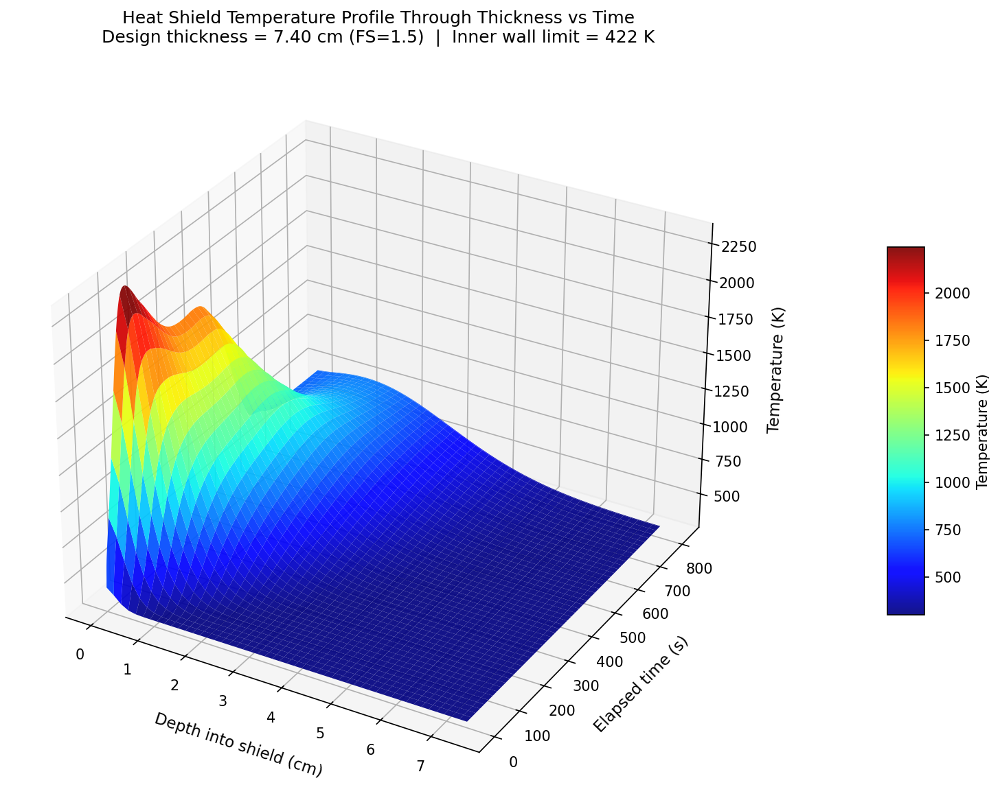
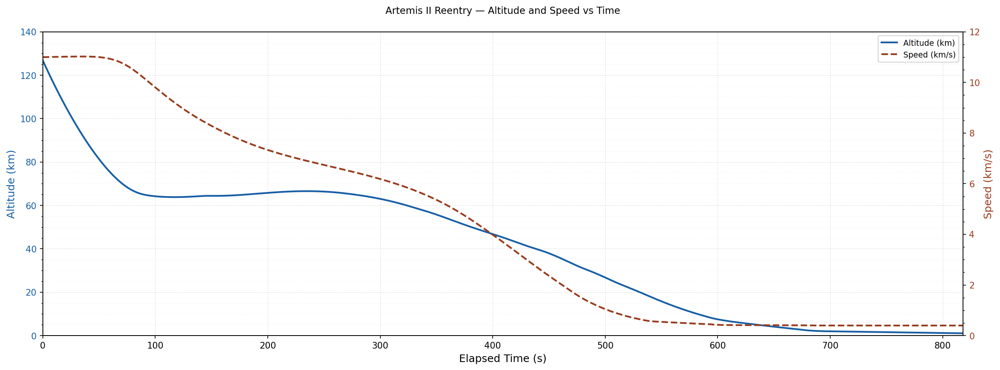
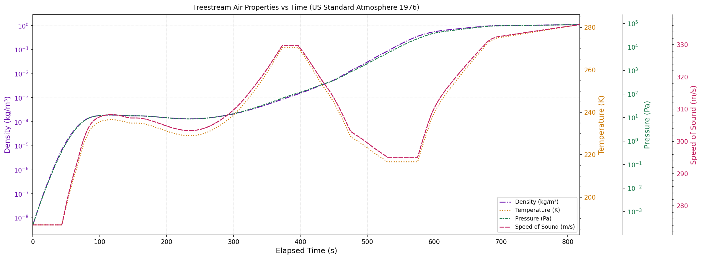
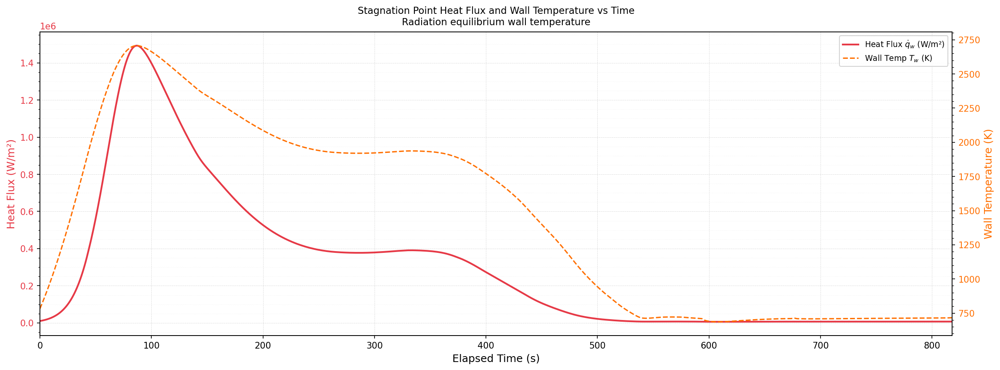

# Artemis II Orion Re-Entry — TPS Sizing

Stagnation-point aerothermal heating analysis and Avcoat heat shield thickness optimization for the NASA Artemis II crew module during lunar-return re-entry.



## Overview

When Orion returns from the Moon it enters the atmosphere at ~11.2 km/s. The bow shock heats the surrounding air past 10,000 K, and the resulting convective flux at the stagnation point would destroy any unprotected structure in seconds. Sizing the thermal protection system (TPS) is therefore a life-critical design problem: too thin risks structural failure, too thick adds mass and launch cost.

This project parses the real NASA Artemis II re-entry trajectory, computes the time-varying stagnation-point heat flux, and solves the 1D transient heat equation through an Avcoat heat shield to find the minimum thickness that keeps the inner aluminum structure below its 422 K limit for the entire re-entry.

## Key Results

| Quantity | Value |
|---|---|
| Peak stagnation-point heat flux | **1.49 MW/m²** |
| Peak outer wall temperature | **2,707 K** |
| Peak inner wall temperature | **305.4 K** (limit: 422 K) |
| Minimum compliant Avcoat thickness | **4.93 cm** |
| Design thickness (FS = 1.5) | **7.40 cm** |

## Method

1. **Trajectory parsing.** Position and velocity vectors are read from the NASA Artemis II ephemeris (M50 ECI frame). Altitude and freestream speed are extracted at each time step.
2. **Freestream properties.** The US Standard Atmosphere 1976 model returns ρ∞, T∞, P∞, µ∞, and speed of sound at each altitude; freestream Mach number is derived from these.
3. **Stagnation-point heat flux.** The Fay–Riddell correlation is applied for M∞ ≥ 1 (with Rankine–Hugoniot post-shock properties, temperature-dependent air properties, and a fully catalytic wall assumption). Sutton–Graves is used as a subsonic fallback.
4. **Radiation equilibrium wall temperature.** Fixed-point iteration solves the coupled system where convective flux in equals radiative flux out (q̇ = εσT⁴), since the Fay–Riddell equation itself depends on Tw.
5. **1D transient heat conduction.** An explicit finite-difference solver (50 spatial nodes, forward-time / central-space) marches the heat equation through the Avcoat slab with a Dirichlet BC at the hot face and an adiabatic BC at the inner face (worst-case).
6. **Thickness optimization.** A bisection search over slab thickness finds the minimum L such that the inner wall stays ≤ 422 K throughout the full 800 s re-entry. A factor of safety of 1.5 is applied to give the final design thickness.

## Results

### Re-entry trajectory


Altitude falls from ~120 km to sea level over ~800 s, with a visible skip maneuver near t = 200 s where the capsule uses aerodynamic lift to return briefly to higher altitude before final entry.

### Freestream conditions


Freestream density and pressure span roughly seven orders of magnitude across the re-entry corridor.

### Stagnation-point heat flux and outer wall temperature


Heat flux peaks sharply near 60–70 km altitude at 1.49 MW/m², where the ρ∞V∞³ product is maximized. The radiation equilibrium outer wall temperature tracks the flux and peaks at 2,707 K.

### Temperature profile through the shield


At the design thickness of 7.40 cm, the peak inner wall temperature is only 305.4 K — 5.4 K above the initial cold-wall temperature and well below the 422 K limit. The bulk of the temperature drop occurs in the outer few centimeters of char, where the gradient is steepest.

## Tools

- **Python** (NumPy, SciPy, Matplotlib) — trajectory parsing, atmosphere model, heat flux correlations, finite-difference solver, bisection optimizer
- **US Standard Atmosphere 1976** for freestream properties
- **NASA TPSX materials database** for charred-state Avcoat 5026-39H/CG properties
- **LaTeX** for the full technical report

## What I'd Do Differently

- **Model ablation.** The single biggest simplification here is treating Avcoat as a non-ablating solid. Real Avcoat pyrolyzes, chars, and recedes during re-entry, carrying heat away from the surface. Coupling a surface recession model would produce a more realistic (and likely thinner) design.
- **Variable material properties.** I used charred-state properties throughout for conservatism. Modeling the virgin-to-char transition with temperature-dependent properties would improve fidelity through the heating pulse.
- **Full 3D surface heating.** The skip trajectory and nonzero angle of attack redistribute heating across the shield. My stagnation-point assumption is valid for the axisymmetric case but not strictly true during the skip. A CFD analysis over the full vehicle geometry would resolve this.

## Repository Structure

```
├── README.md
├── src/
│   └── Heat_Transfer_of_the_Orion_Re-Entry_Capsule_A2.py   # main solver
├── data/
│   └── 2026_04.10_Post-RTC3_to_EI                          # NASA Artemis II ephemeris
├── docs/
│   └── Heat_Transfer_Project_Report.pdf                    # full technical report
└── media/
    ├── capsule_schematic.jpg
    ├── wall_schematic.jpg
    ├── fig1_altitude_speed.png
    ├── fig2_freestream.png
    ├── fig3_heat_flux.png
    └── fig4_temp_profile_3d.png
```

## Author

**Owen Asbridge** — Senior Mechanical Engineering, South Dakota Mines
May 2026
